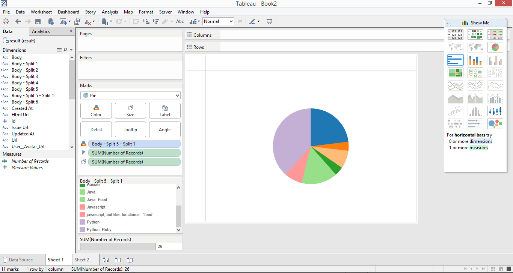

# Tableau Visualization

Tableau is arguably the biggest deal now in terms of data visualization for non-programmers.
Let's pretend you are not a programer. Learn and experience what it is like to make
visualizations using Tableau to answer the same questions about your classmates in our course.

For each of the question, think about what chart you should use to convey your answer and
make your best effort to create something that makes sense to you. There's no right
or wrong. When we meet in the class again, we will set aside time for each team to discuss
and compare the variety of visualization solutions each member has come up with for the
same set of questions. It will be fun!

To include a Tableau visualization in your report, take a screenshot, save it as an image,
put it in the `learning/week2` folder, and replace ``  with
your own image. Please makes sure your screenshot includes the _entire_ Tableau interface
including the controls, widgets ...etc.

# How big the deal Tableau really is?

"223% between 2012 and 2014 to $412.6 million and climbed 75% in the first quarter to $130 million" from Forbes

# Favorite Languages

(The Pie chart shows that Python was the most popular. In the bottom left hand corner, you can see the colors associated with each language. Blues are C/C++)

# Commented Before class

()

# Updated Comment

()

# % that are CS Majors

Another pie chart with major assocaited by color shown in bottom left hand corner
